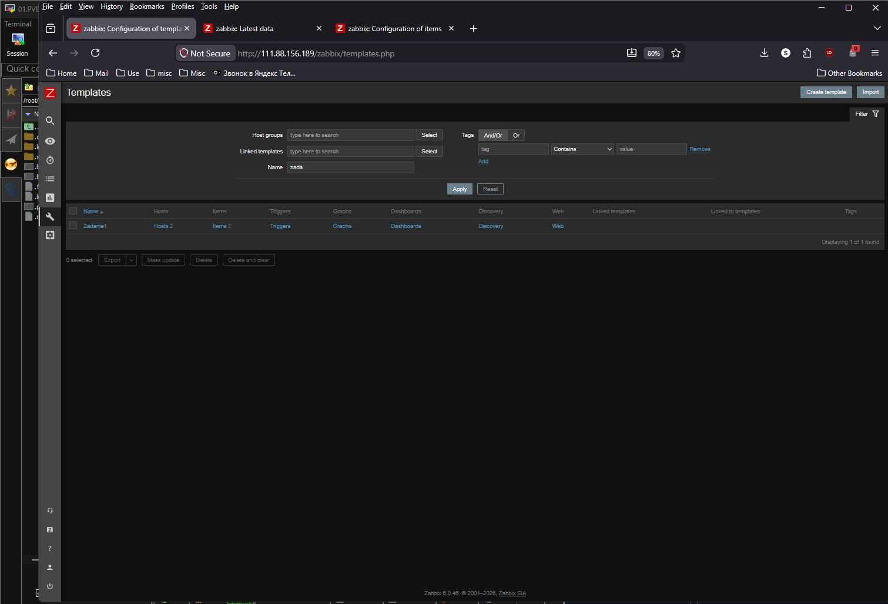
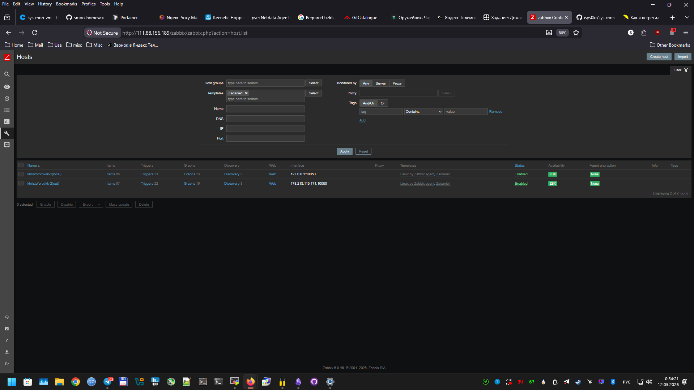
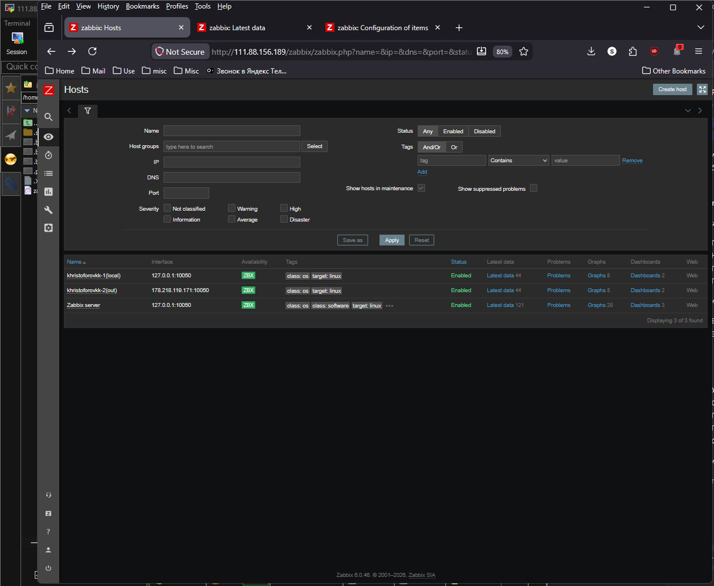
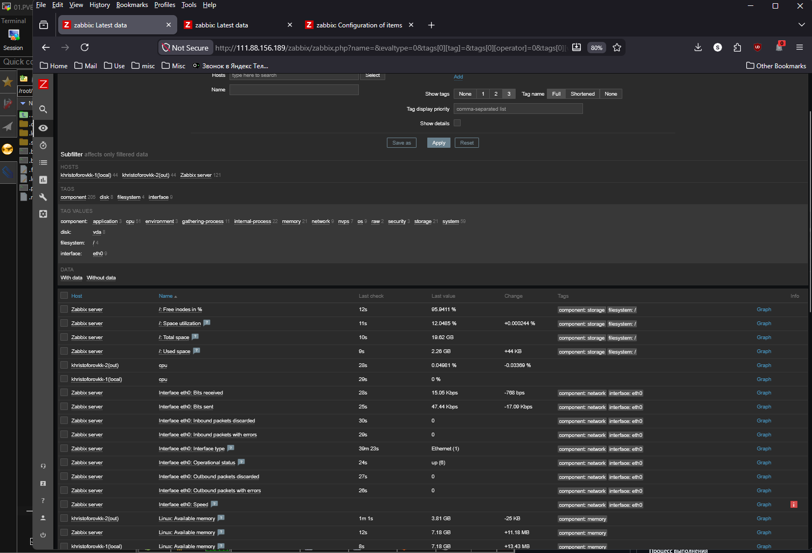
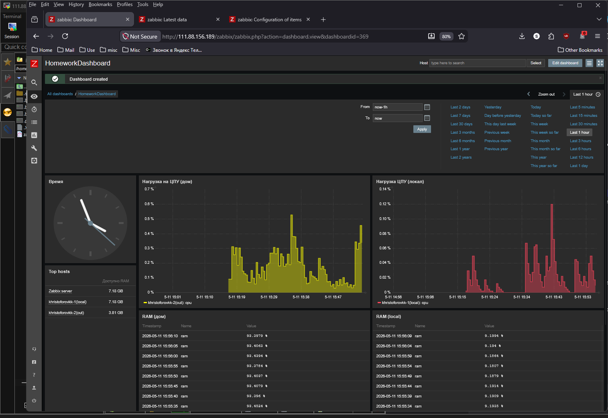

# Домашнее задание к занятию "Система мониторинга Zabbix" - Христофоров Константин

---

## Задание 1

* Создайте свой шаблон, в котором будут элементы данных, мониторящие загрузку CPU и RAM хоста.
* Процесс выполнения

*    Выполняя ДЗ сверяйтесь с процессом отражённым в записи лекции.
*    В веб-интерфейсе Zabbix Servera в разделе Templates создайте новый шаблон
*    Создайте Item который будет собирать информацию об загрузке CPU в процентах
*    Создайте Item который будет собирать информацию об загрузке RAM в процентах

### Требования к результату

*    Прикрепите в файл README.md скриншот страницы шаблона с названием «Задание 1»

## Задание 1: Создание кастомного шаблона (CPU и RAM в %)

### Процесс выполнения:
1. В разделе **Configuration → Templates** создан новый шаблон с именем **«Zadanie 1»**.
2. В шаблон добавлены два элемента данных (Items):
   - **CPU Load %**: 
     - Ключ: `system.cpu.load[percpu,avg1]`
     - Единицы измерения: `%`.
   - **RAM Usage %**:
     - Ключ: `vm.memory.size[pused]` (возвращает процент использованной памяти).
     - Единицы измерения: `%`.

### Результат:
Ниже представлен скриншот страницы шаблона с созданными элементами данных.

---

## Задание 2

*Добавьте в Zabbix два хоста и задайте им имена <фамилия и инициалы-1> и <фамилия и инициалы-2>. Например: ivanovii-1 и ivanovii-2.
*Процесс выполнения

*    Выполняя ДЗ сверяйтесь с процессом отражённым в записи лекции.
*    Установите Zabbix Agent на 2 виртмашины, одной из них может быть ваш Zabbix Server
*   Добавьте Zabbix Server в список разрешенных серверов ваших Zabbix Agentов
*    Добавьте Zabbix Agentов в раздел Configuration > Hosts вашего Zabbix Servera
*    Прикрепите за каждым хостом шаблон Linux by Zabbix Agent
*    Проверьте что в разделе Latest Data начали появляться данные с добавленных агентов

### Требования к результату

*    Результат данного задания сдавайте вместе с заданием 3
## Задание 2: Добавление хостов и установка агентов

### Процесс выполнения:
1. Созданы два хоста с именами:
   - `khristoforovkk-1` (локальный сервер Zabbix).
   - `khristoforovkk-2` (удаленный хост в домашней сети).
2. На обоих хостах установлен и настроен **Zabbix Agent 6.0**.
3. В конфигурационных файлах агентов (`/etc/zabbix/zabbix_agentd.conf`) прописаны:
   - `Server=<IP_Zabbix_Server>`
   - `Hostname=khristoforovkk-1` (или `-2` соответственно).
4. Хосты добавлены в раздел **Configuration → Hosts**.
5. К каждому хосту привязан стандартный шаблон **Linux by Zabbix agent**.
6. Проверено появление данных в разделе **Monitoring → Latest Data**.

*(Результат этого задания объединен со Заданием 3 ниже)*

## Задание 3

* Привяжите созданный шаблон к двум хостам. Также привяжите к обоим хостам шаблон Linux by Zabbix Agent.
* Процесс выполнения

*    Выполняя ДЗ сверяйтесь с процессом отражённым в записи лекции.
*    Зайдите в настройки каждого хоста и в разделе Templates прикрепите к этому хосту ваш шаблон
*    Так же к каждому хосту привяжите шаблон Linux by Zabbix Agent
*    Проверьте что в раздел Latest Data начали поступать необходимые данные из вашего шаблона

### Требования к результату

*    Прикрепите в файл README.md скриншот страницы хостов, где будут видны привязки шаблонов с названиями «Задание 2-3». Хосты должны иметь зелёный статус подключения

## Задание 3: Привязка кастомного шаблона к хостам

### Процесс выполнения:
1. В настройки каждого хоста (`khristoforovkk-1` и `khristoforovkk-2`) в разделе **Templates** добавлен созданный ранее шаблон **«Задание 1»**.
2. Таким образом, к каждому хосту привязаны два шаблона:
   - `Linux by Zabbix agent` (стандартный мониторинг ОС).
   - `Zadanie 1` (кастомный мониторинг CPU/RAM в %).
3. Статус подключения хостов стал **зеленым (ZBX)**, что означает успешное соединение.
4. В разделе **Latest Data** начали поступать данные как от стандартных метрик, так и от кастомных (CPU load %, RAM usage %).

### Результат:
На скриншоте ниже виден список хостов с зеленым статусом и вкладка Templates, где видны привязанные шаблоны. Также представлены данные из Latest Data.

---

## Задание 4

* Создайте свой кастомный дашборд.
* Процесс выполнения

*    Выполняя ДЗ сверяйтесь с процессом отражённым в записи лекции.
*    В разделе Dashboards создайте новый дашборд
*    Разместите на нём несколько графиков на ваше усмотрение.

### Требования к результату

*    Прикрепите в файл README.md скриншот дашборда с названием «Задание 4»
## Задание 4: Кастомный дашборд

### Процесс выполнения:
1. В разделе **Dashboards** создан новый дашборд с названием **«HomeworkDashboard»**.
2. На дашборд добавлены следующие виджеты:
   - **График (Graph)**: Загрузка CPU (%) для обоих хостов.
   - **График (Graph)**: Использование RAM (%) для обоих хостов.
   - **Таблица (Data over time / Top hosts)**: Для отображения текущих значений метрик.

### Результат:
Скриншот итогового кастомного дашборда.

