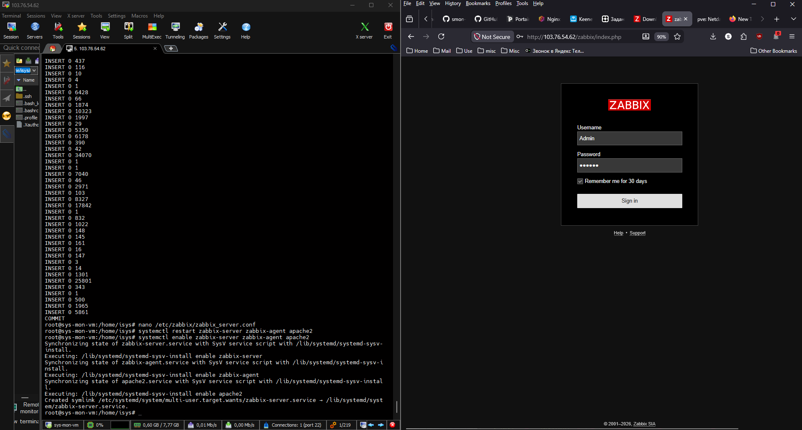
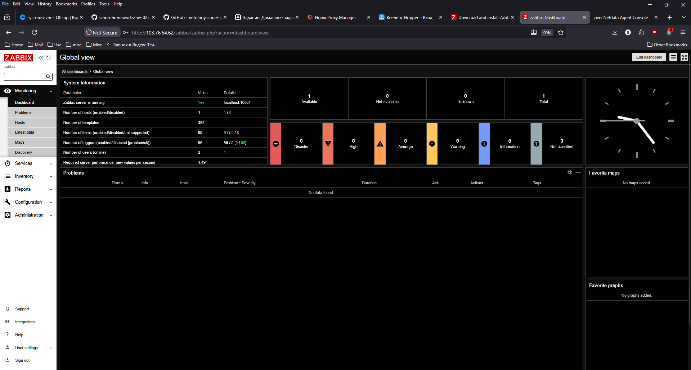
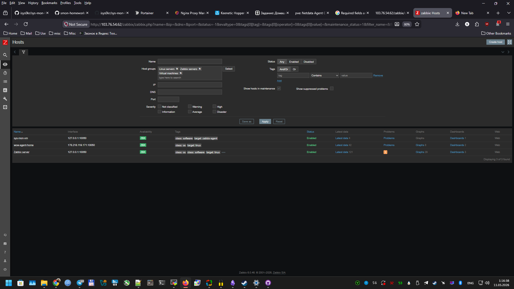
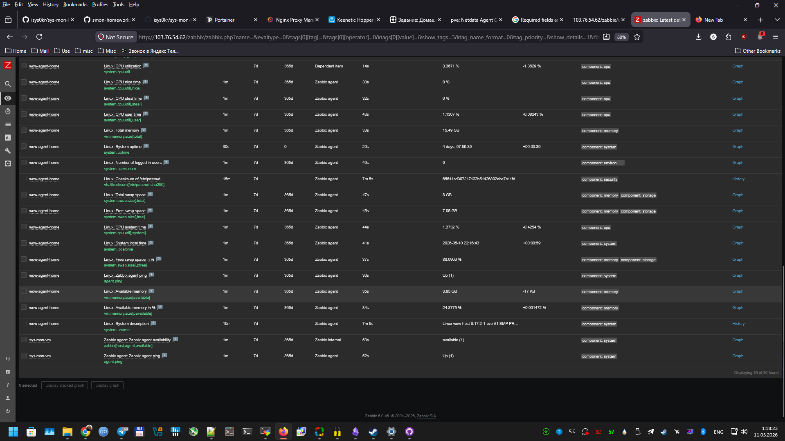

# Домашнее задание к занятию "`Система мониторинга Zabbix`" - `Христофоров Константин`

---

## Задание 1: Установка Zabbix Server с веб-интерфейсом


### Установите Zabbix Server с веб-интерфейсом.
Процесс выполнения

    Выполняя ДЗ, сверяйтесь с процессом отражённым в записи лекции.
    Установите PostgreSQL. Для установки достаточна та версия, что есть в системном репозитороии Debian 11.
    Пользуясь конфигуратором команд с официального сайта, составьте набор команд для установки последней версии Zabbix с поддержкой PostgreSQL и Apache.
    Выполните все необходимые команды для установки Zabbix Server и Zabbix Web Server.

Требования к результатам

    Прикрепите в файл README.md скриншот авторизации в админке.
    Приложите в файл README.md текст использованных команд в GitHub.


#### Используемые команды
```bash
# 1. Подключение репозитория Zabbix 6.0 LTS для Debian 11
wget https://repo.zabbix.com/zabbix/6.0/debian/pool/main/z/zabbix-release/zabbix-release_latest_6.0+debian11_all.deb
dpkg -i zabbix-release_latest_6.0+debian11_all.deb
apt update

# 2. Установка и запуск PostgreSQL
apt install -y postgresql postgresql-contrib
systemctl start postgresql
systemctl enable postgresql

# 3. Установка Zabbix Server, Web-frontend, Apache и PHP 7.4
apt install -y zabbix-server-pgsql zabbix-frontend-php php7.4-pgsql zabbix-apache-conf zabbix-sql-scripts zabbix-agent

# 4. Создание БД и пользователя
sudo -u postgres createuser --pwprompt zabbix
sudo -u postgres createdb -O zabbix zabbix

# 5. Импорт схемы Zabbix
zcat /usr/share/zabbix-sql-scripts/postgresql/server.sql.gz | sudo -u zabbix psql zabbix

# 6. Настройка подключения к БД и часового пояса
sed -i 's/# DBPassword=/DBPassword=***/' /etc/zabbix/zabbix_server.conf
sed -i 's/;date.timezone =/date.timezone = Europe\/Moscow/' /etc/php/7.4/apache2/php.ini

# 7. Перезапуск служб и автозагрузка
systemctl restart zabbix-server zabbix-agent apache2
systemctl enable zabbix-server zabbix-agent apache2
```bash

### Результат





#### Задание 2

##### Установите Zabbix Agent на два хоста.
Процесс выполнения

    Выполняя ДЗ, сверяйтесь с процессом отражённым в записи лекции.
    Установите Zabbix Agent на 2 вирт.машины, одной из них может быть ваш Zabbix Server.
    Добавьте Zabbix Server в список разрешенных серверов ваших Zabbix Agentов.
    Добавьте Zabbix Agentов в раздел Configuration > Hosts вашего Zabbix Servera.
    Проверьте, что в разделе Latest Data начали появляться данные с добавленных агентов.

Требования к результатам

    Приложите в файл README.md скриншот раздела Configuration > Hosts, где видно, что агенты подключены к серверу
    Приложите в файл README.md скриншот лога zabbix agent, где видно, что он работает с сервером
    Приложите в файл README.md скриншот раздела Monitoring > Latest data для обоих хостов, где видны поступающие от агентов данные.
    Приложите в файл README.md текст использованных команд в GitHub


# Процесс выполнения:

    Хост 1 (sys-mon-vm): Локальный агент установлен вместе с сервером. Настроен на работу через localhost (127.0.0.1).
    Хост 2 (wow-agent-home): Удаленный хост, развернутый в LXC контейнере на Proxmox VE.
        Установлен пакет zabbix-agent.
        В конфигурации /etc/zabbix/zabbix_agentd.conf указан IP Zabbix Server (103.76.54.62) и уникальное имя хоста wow-agent-home.
        На домашнем роутере настроен Port Forwarding (проброс порта TCP 10050 на внутренний IP контейнера 192.168.1.21).
        Открыт порт 10050 в локальном фаерволе (ufw allow 10050/tcp).
    В веб-интерфейсе Zabbix созданы два хоста:
        sys-mon-vm (IP: 127.0.0.1)
        wow-agent-home (IP: 178.218.119.171 — внешний IP дома)

	
	
	
	
	
# 1. Установка агента
	```bash
apt update
apt install -y zabbix-agent
```bash

# 2. Настройка конфигурации
```bash
nano /etc/zabbix/zabbix_agentd.conf
```bash

# Изменить следующие параметры:
```bash
# Server=103.76.54.62
# ServerActive=103.76.54.62
# Hostname=wow-agent-home
```bash

# 3. Открытие порта в фаерволе
```bash
ufw allow 10050/tcp
ufw status
```bash

# 4. Перезапуск агента
```bash
systemctl restart zabbix-agent
systemctl enable zabbix-agent
```bash

# 5. Проверка логов
```bash
tail -f /var/log/zabbix/zabbix_agentd.log
```bash


# Установка утилиты для проверки
```bash
apt install -y zabbix-get netcat-openbsd
```bash
# Проверка доступности порта агента
```bash
nc -zv 178.218.119.171 10050
```bash

# Проверка получения данных от агента
```bash
zabbix_get -s 178.218.119.171 -p 10050 -k agent.ping
```bash


### Результат


